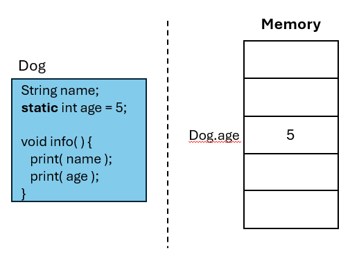

# Lab Assignment 13

In this lab you will practice working with static variables.

Unlike previous labs, your class has already been created for you. 

## Let's get started!

For this lab your **main() method** is in the School class. You can create any new classes below the Shool class or inside a new java file. 

Now let's begin!

## Static

The static keyword is used for accessing methods and attributes from a class without an object, however its main purpose is for memory management.

**Static variables** are initiated prior to being instanciated. This means static variables are allocated in memory prior to the creation of any objects.



Thus the same static variable is used throughout all instances (objects). If a static variable is updated in one objects, it gets updated for all the other objects.


The static keyword must be added before the type of the attribute or method.

**Code Example:**

```java
public class Owner {
    public static void main(String[] args) {
        // Object 1
        Dog dog1 = new Dog();
        dog1.age = 7;

        // Object 2
        Dog dog2 = new Dog();
        dog2.showAge(); // Will output 7, since age is static.
    }
}

class Dog {
    public String name;
    public static int age = 5; // same variable will be used for all objects.

    public void showAge() {
        System.out.println(age);
    }
}
```

**Static methods (functions)** are simply accessible outside the class without an object. This means any outside variables & methods called inside a static method must be static themselves, since they need to allocated and initialized prior.

## Your Program

### Student Manager

Create a class `Student` with the following **public** attributes `name`, `email`, `school_id` and with method `studentInfo()` that prints out the name, email, and school_id of each student.

Since all students go to the same school, make the `school_id` **static**.

Now, see for yourself how **static** variables work. <ins>Create 3 Student objects</ins> with a unique `name` and `email`, but same `school_id`. Next, see how updating the `school_id` for one objects affects all the other objects by printing their `studentInfo()` before and after updating the school_id for only one Student object.

Your output should look like:

```
Student Info: Bob Bobbert, bob@uni.edu, 123
Student Info: Carl Carlton, carl@uni.edu, 123
Student Info: Jane Janeson, jane@uni.edu, 123

Student Info: Bob Bobbert, bob@uni.edu, 456
Student Info: Carl Carlton, carl@uni.edu, 456
Student Info: Jane Janeson, jane@uni.edu, 456
```

## Submit your assignment

To submit your lab assignment click on the source control icon (3 circles with 2 lines) on your leftside navbar. Next, click on the '+' symbol next to "Changes" to stage your changes. Lastly, add a commit message (ex: "First commit") and click "Commit" then "Push" or "Sync Changes". And you're done!
